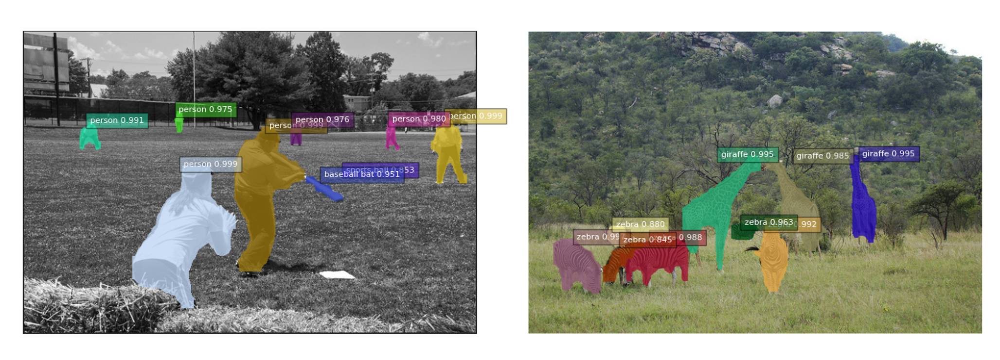

## Fully Convolutional Instance-aware Semantic Segmentation

The major contributors of this repository include [Haozhi Qi](https://github.com/Oh233), [Yi Li](https://github.com/liyi14), [Guodong Zhang](https://github.com/gd-zhang), [Haochen Zhang](https://github.com/Braininvat), [Jifeng Dai](https://github.com/daijifeng001), and [Yichen Wei](https://github.com/YichenWei).

### Introduction

**FCIS** is a fully convolutional end-to-end solution for instance segmentation, which won the first place in COCO segmentation challenge 2016. 

FCIS is initially described in a [CVPR 2017 spotlight paper](https://arxiv.org/abs/1611.07709). It is worth noticing that:
* FCIS provides a simple, fast and accurate framework for instance segmentation.
* Different from [MNC](https://github.com/daijifeng001/MNC), FCIS performs instance mask estimation and categorization jointly and simultanously, and estimates class-specific masks.
* We did not exploit the various techniques & tricks in the Mask RCNN system, like increasing RPN anchor numbers (from 12 to 15), training on anchors out of image boundary, enlarging the image (shorter side from 600 to 800 pixels), utilizing FPN features and aligned ROI pooling. These techniques & tricks should be orthogonal to our simple baseline.


### Resources

1. Visual results on the first 5k images from COCO test set of our ***COCO 2016 challenge entry***: [OneDrive](https://onedrive.live.com/?authkey=%21ABB_CV2zvCEoNK0&id=F371D9563727B96F%2192190&cid=F371D9563727B96F).
2. Slides in [ImageNet ILSVRC and COCO workshop 2016](http://image-net.org/challenges/ilsvrc+coco2016): [OneDrive](https://onedrive.live.com/?cid=f371d9563727b96f&id=F371D9563727B96F%2197213&authkey=%21AEYOyOirjIutSVk).




### Disclaimer

This is an official implementation for [Fully Convolutional Instance-aware Semantic Segmentation](https://arxiv.org/abs/1611.07709) (FCIS) based on MXNet. It is worth noticing that:

  * The original implementation is based on our internal Caffe version on Windows. There are slight differences in the final accuracy and running time due to the plenty details in platform switch.
  * The code is tested on official [MXNet@(commit 62ecb60)](https://github.com/dmlc/mxnet/tree/62ecb60) with the extra operators for FCIS.
  * We trained our model based on the ImageNet pre-trained [ResNet-v1-101](https://github.com/KaimingHe/deep-residual-networks) using a [model converter](https://github.com/dmlc/mxnet/tree/430ea7bfbbda67d993996d81c7fd44d3a20ef846/tools/caffe_converter). The converted model produces slightly lower accuracy (Top-1 Error on ImageNet val: 24.0% v.s. 23.6%).
  * This repository used code from [MXNet rcnn example](https://github.com/dmlc/mxnet/tree/master/example/rcnn) and [mx-rfcn](https://github.com/giorking/mx-rfcn).


### License

© Microsoft, 2017. Licensed under an Apache-2.0 license.

### Citing FCIS

If you find FCIS useful in your research, please consider citing:
```
@inproceedings{li2016fully,
  Author = {Yi Li, Haozhi Qi, Jifeng Dai, Xiangyang Ji and Yichen Wei}
  Title = {Fully Convolutional Instance-aware Semantic Segmentation},
  Conference = {CVPR},
  year = {2017}
}
```

### Main Results

|                                 | training data  | testing data | mAP^r@0.5 | mAP^r@0.7 | time   |
|:---------------------------------:|:----------------:|:--------------:|:-----------:|:-----------:|:--------:|
| FCIS, ResNet-v1-101             | VOC 2012 train | VOC 2012 val | 66.0      | 51.9      |   0.23s    |

|                                 | <sub>training data</sub> | <sub>testing data</sub>  | <sub>mAP^r</sub>  | <sub>mAP^r@0.5</sub> | <sub>mAP^r@0.75</sub>| <sub>mAP^r@S</sub> | <sub>mAP^r@M</sub> | <sub>mAP^r@L</sub> |
|:---------------------------------:|:---------------:|:---------------:|:------:|:---------:|:---------:|:-------:|:-------:|:-------:|
| <sub>FCIS, ResNet-v1-101, OHEM </sub> | <sub>coco trainval35k</sub> | <sub>coco minival</sub> | 28.7 | 50.5 | 28.8 | 7.7 | 31.0 | 50.1 |
| <sub>FCIS, ResNet-v1-101, OHEM </sub> | <sub>coco trainval35k</sub> | <sub>coco test-dev</sub>| 29.0 | 51.2 | 29.5 | 7.7 | 30.6 | 48.9 |

*Running time is counted on a single Maxwell Titan X GPU (mini-batch size is 1 in inference).*

### Requirements: Software

1. MXNet from [the offical repository](https://github.com/dmlc/mxnet). We tested our code on [MXNet@(commit 62ecb60)](https://github.com/dmlc/mxnet/tree/62ecb60). Due to the rapid development of MXNet, it is recommended to checkout this version if you encounter any issues. We may maintain this repository periodically if MXNet adds important feature in future release.

2. Python packages might missing: cython, opencv-python >= 3.2.0, easydict. If `pip` is set up on your system, those packages should be able to be fetched and installed by running
	```
	pip install Cython
	pip install opencv-python==3.2.0.6
	pip install easydict==1.6
	pip install hickle
	```
3. For Windows users, Visual Studio 2015 is needed to compile cython module.


### Requirements: Hardware

Any NVIDIA GPUs with at least 5GB memory should be OK

### Installation

1. Clone the FCIS repository
~~~
git clone https://github.com/msracver/FCIS.git
~~~
2. For Windows users, run ``cmd .\init.bat``. For Linux user, run `sh ./init.sh`. The scripts will build cython module automatically and create some folders.
3. Copy operators in `./fcis/operator_cxx` to `$(YOUR_MXNET_FOLDER)/src/operator/contrib` and recompile MXNet.
4. Please install MXNet following the official guide of MXNet. For advanced users, you may put your Python packge into `./external/mxnet/$(YOUR_MXNET_PACKAGE)`, and modify `MXNET_VERSION` in `./experiments/fcis/cfgs/*.yaml` to `$(YOUR_MXNET_PACKAGE)`. Thus you can switch among different versions of MXNet quickly.


### Demo

1. To run the demo with our trained model (on COCO trainval35k), please download the model manually from [OneDrive](https://1drv.ms/u/s!Am-5JzdW2XHzhqMJZmVOEDgfde8_tg), and put it under folder `model/`.

	Make sure it looks like this:
	```
	./model/fcis_coco-0000.params
	```
2. Run
	```
	python ./fcis/demo.py
	```

### Preparation for Training & Testing

1. Please download VOC 2012 dataset with additional annotations from [SBD](http://home.bharathh.info/pubs/codes/SBD/download.html). Move ```inst, cls, img``` folders to VOCdevit and make sure it looks like this:

   Please use the train&val split in this repo, which follows the protocal of [SDS](https://www2.eecs.berkeley.edu/Research/Projects/CS/vision/shape/sds/).

	```
	.data/VOCdevkit/VOCSDS/img/
	.data/VOCdevkit/VOCSDS/inst/
	.data/VOCdevkit/VOCSDS/cls/
	```
	
2. Please download [COCO dataset](http://mscoco.org/dataset/#download) and annotations for the 5k image [minival](https://dl.dropboxusercontent.com/s/o43o90bna78omob/instances_minival2014.json.zip?dl=0) subset and [val2014 minus minival (val35k)](https://dl.dropboxusercontent.com/s/s3tw5zcg7395368/instances_valminusminival2014.json.zip?dl=0). Make sure it looks like this:
	```
	.data/coco/
	.data/coco/annotations/instances_valminusminival2014.json
	.data/coco/annotations/instances_minival2014.json
	```

3. Please download ImageNet-pretrained ResNet-v1-101 model manually from [OneDrive](https://1drv.ms/u/s!Am-5JzdW2XHzhqMEtxf1Ciym8uZ8sg), and put it under folder `./model`. Make sure it looks like this:
	```
	./model/pretrained_model/resnet_v1_101-0000.params
	```

### Usage

1. All of our experiment settings (GPU #, dataset, etc.) are kept in yaml config files at folder `./experiments/fcis/cfgs`.
2. Two config files have been provided so far: FCIS@COCO with OHEM and FCIS@VOC without OHEM. We use 8 and 4 GPUs to train models on COCO and on VOC, respectively.
3. To perform experiments, run the python scripts with the corresponding config file as input. For example, to train and test FCIS on COCO with ResNet-v1-101, use the following command
    ```
    python experiments/fcis/fcis_end2end_train_test.py --cfg experiments/fcis/cfgs/resnet_v1_101_coco_fcis_end2end_ohem.yaml
    ```
    A cache folder would be created automatically to save the model and the log under `output/fcis/coco/` or `output/fcis/voc/`.
4. Please find more details in config files and in our code.

### Misc.

Code has been tested under:

- Ubuntu 14.04 with a Maxwell Titan X GPU and Intel Xeon CPU E5-2620 v2 @ 2.10GHz
- Windows Server 2012 R2 with 8 K40 GPUs and Intel Xeon CPU E5-2650 v2 @ 2.60GHz
- Windows Server 2012 R2 with 4 Pascal Titan X GPUs and Intel Xeon CPU E5-2650 v4 @ 2.30GHz
