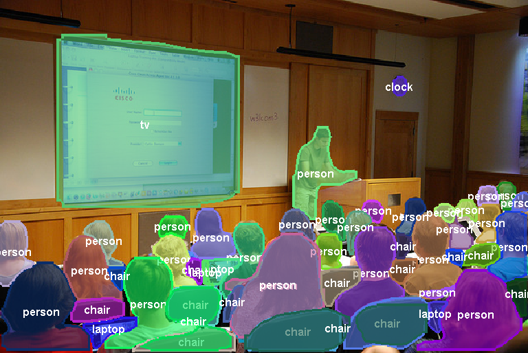
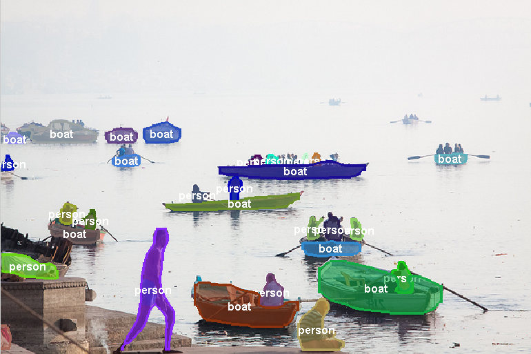
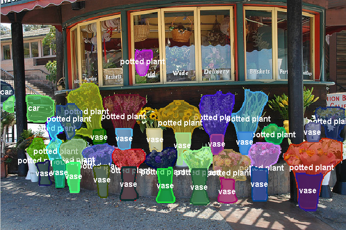
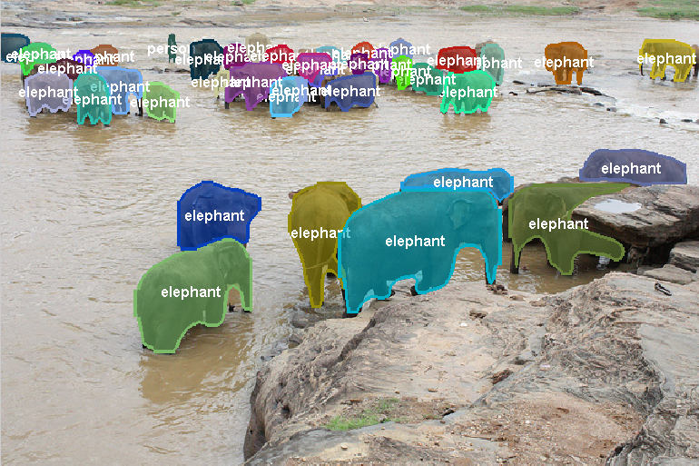

# TA-FCN
Translation-aware Fully Convolutional Instance Segmentation

Yi Li\*, Haozhi Qi\*, Jifeng Dai, Xiangyang Ji, Yichen Wei

(\* Equal contribution. Work was done when Yi Li and Haozhi Qi were interns at MSRA)

### Introduction

This is the repository for TA-FCN, which is the winning entry of [COCO segmentation challenge 2016](http://mscoco.org/dataset/#detections-challenge2016).

### Resources

0. Visual results on the first 5k images from COCO test set: [OneDrive](https://onedrive.live.com/?authkey=%21ABB_CV2zvCEoNK0&id=F371D9563727B96F%2192190&cid=F371D9563727B96F)
0. Slides in ImageNet ILSVRC and COCO workshop 2016: OneDrive
0. Code of TA-FCN is coming soon!
